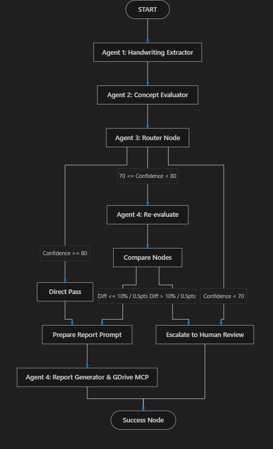

# ScribeAI

AI-powered handwritten answer sheet evaluation using Google ADK 2.0, Gemini 2.5 Flash, Agent Skills, and Google Drive MCP.

---

## 🎯 Kaggle Submission: Reference Materials

This repository is prepared for Kaggle evaluation and includes pre-packaged reference materials and answer sheets to demonstrate ScribeAI's capabilities across different evaluation scenarios.

### 📚 Reference PDFs Included in Project Root
* **[OBJECT ORIENTED PROGRAMMING USING C++.pdf](file:///OBJECT%20ORIENTED%20PROGRAMMING%20USING%20C%2B%2B.pdf)**: The official C++ OOP exam question paper.
* **[Answer booklet.pdf](file:///Answer%20booklet.pdf)**: The printed answer booklet template containing student instructions and blank pages where students write their exams.

### 📝 Evaluation Marking Scheme
The grading engine uses a structured C++ OOP marking scheme located at **[app/marking_scheme.json](file:///app/marking_scheme.json)**.
> [!IMPORTANT]
> **AI Grading Axiom**: The grading capability of the AI is directly proportional to how detailed and robust the marking scheme JSON is. Detailed concept lists lead to extremely accurate, objective, and consistent evaluations.

### 📂 Sample Student Answer Sheets (in `sample/`)
The `sample/` directory contains 5 distinct student answer sheets for testing:
* `sample/Answersheet_Robin_Danie_CS001.pdf`
* `sample/Answersheet_clearFail_CS002.pdf`
* `sample/Answersheet_average_CS003.pdf`
* `sample/Answersheet_PromptInjection_CS004.pdf`
* `sample/Answersheet_worstHandwriting_CS005.pdf`

---

## ⚙️ Installation & Setup

Follow these steps to set up the ScribeAI grading pipeline on your local machine:

### 1. Clone the Repository
```bash
git clone <repository-url>
cd scribeai
```

### 2. Install Dependencies
ScribeAI uses `uv` for python environment and dependency management. Run the following command to sync and install the environment:
```bash
uv sync
```

### 3. Configure Environment Variables
Create a `.env` file in the project root folder and provide your Gemini API key:
```env
GEMINI_API_KEY=your_api_key_here
```
> [!WARNING]
> **API Key Safety**: Do not commit your `.env` file to Git. Every evaluator must use their own API key.

### 4. Configure Google Drive MCP (Optional)
ScribeAI can automatically upload results and reports to Google Drive. To configure this optional integration:
1. **Create Google Cloud Project**: Go to the [Google Cloud Console](https://console.cloud.google.com/), create a project, and enable the **Google Drive API**.
2. **Setup OAuth Consent & Client**: Configure the OAuth Consent Screen and create client credentials for a **Desktop app**.
3. **Save Credentials**: Download the client credentials JSON file, rename it to `credentials.json`, and place it in the root folder of this project.
4. **Install Local Dependencies**: On Windows, to prevent temporary cache issues, install the MCP server locally in the workspace:
   ```bash
   npm install @modelcontextprotocol/server-gdrive
   ```
5. **Authenticate**: Upon your first pipeline run, the Google Drive MCP server will prompt you to authenticate via your web browser.

---

## 🚀 Running ScribeAI (Web UI & CLI)

Once setup is complete, you can run evaluations in two ways:

### Option A: Interactive Web UI Playground
Start the local server:
```bash
uv run adk web --port 8000
```
Open **http://localhost:8000** in your browser. From here, you can:
* Chat with ScribeAI, upload any PDF/image answer sheet, and watch it grade in real-time.
* **Batch Grade All Papers at Once**: Simply send the word `sample` in the Web UI chat. ScribeAI will automatically detect it as a folder, grade all 5 papers sequentially, and save results.

### Option B: Programmatic CLI Evaluation
If you want to run the pipeline programmatically in your terminal:

* **Evaluate a Single Paper**:
  ```bash
  uv run python scratch/test_run.py
  ```
  *(Grades Robin Danie's paper CS001)*

* **Batch Evaluate All 5 Sample Papers**:
  ```bash
  uv run python scratch/test_batch.py
  ```
  *(Grades all student papers in the `sample/` folder sequentially)*

### 📊 Grading Outputs
Once an evaluation runs, ScribeAI stores results in:
* **`spreadsheets/results.xlsx`** (Excel results logging)
* **`reports/report_<student_id>.md`** (Question-by-concept markdown grading reports)
* **`batch_reports/batch_<timestamp>.md`** (Master run batch summary, when batch processed)

---

## Overview

ScribeAI is a multi-agent system that automates the evaluation of handwritten student answer sheets.

The system reads scanned answer sheets, evaluates answers against a professor-defined marking scheme, performs confidence-based quality control, generates detailed feedback, and stores results automatically.

The goal is not to replace professors, but to reduce repetitive grading workload while ensuring that uncertain cases are reviewed by a human.

---

## Problem Statement

Professors often evaluate dozens of handwritten answer sheets for every examination. This process is time-consuming, repetitive, and can lead to inconsistencies when large batches of papers must be graded under time constraints.

Students usually receive only a final score and rarely receive detailed feedback explaining where marks were gained or lost.

ScribeAI explores how AI agents can assist with routine evaluation while keeping human judgment involved whenever needed.

---

## Workflow



The system follows a four-agent workflow:

### Agent 1 – Handwriting Extractor

Responsibilities:

* Read scanned images and PDFs
* Extract handwritten answers
* Identify student information
* Generate handwriting confidence score
* Detect suspicious content and prompt injection attempts

Output:

```json
{
  "student_name": "...",
  "roll_number": "...",
  "answers": [...]
}
```

---

### Agent 2 – Concept Evaluator

Responsibilities:

* Read professor marking scheme
* Evaluate answers concept-by-concept
* Award marks based on rubric
* Detect keyword stuffing
* Generate evaluation confidence score

Match Levels:

* Full Match = 100%
* Partial Match = 50%
* No Match = 0%

---

### Agent 3 – Router Node

Responsibilities:

* Quality control
* Routing decisions
* Human review escalation

Routing Rules:

#### Direct Pass

* Legibility Confidence ≥ 80
* Evaluation Confidence ≥ 80
* Score between 10% and 95%

#### Second Opinion

* Confidence between 70 and 79
* Extreme scores
* Any uncertain evaluation

#### Human Review

* Confidence below 70
* Suspicious content detected
* Major disagreement between evaluators

---

### Agent 4 – Senior Evaluator & Report Generator

Responsibilities:

* Independent re-evaluation
* Compare scores
* Generate final reports
* Upload results via MCP
* Maintain grading logs

---

## Architecture

```text
Student Answer Sheet
        ↓
Agent 1
Handwriting Extraction
        ↓
Agent 2
Concept Evaluation
        ↓
Agent 3
Routing Logic
   ↙         ↘
Human      Agent 4
Review   Second Opinion
              ↓
      Final Report
              ↓
     Google Drive MCP
              ↓
      Results Spreadsheet
```

---

## Features

### Handwritten Answer Evaluation

Reads handwritten answers from scanned images and PDFs using Gemini Vision.

### Concept-Based Grading

Grades based on concepts rather than exact wording.

### Human-in-the-Loop

Escalates uncertain evaluations to professors.

### Batch Processing

Processes entire folders of answer sheets.

### Detailed Feedback

Generates question-wise feedback for every student.

### Spreadsheet Logging

Maintains:

* results.xlsx
* results.csv

### Google Drive Integration

Uploads reports and spreadsheets automatically using Google Drive MCP.

### Security Controls

* Blind grading
* Prompt injection detection
* Output validation
* Confidence-based routing

---

## Project Structure

```text
scribeai/
├── AGENTS.md
├── CONTEXT.md
├── Makefile
├── pyproject.toml
│
├── app/
│   └── agent.py
│
├── assets/
│   └── workflow.png
│
├── uploads/
├── extracted/
├── evaluations/
├── reports/
├── spreadsheets/
├── batch_reports/
│
├── .agents/
│   └── skills/
│       ├── handwriting-extractor/
│       │   └── SKILL.md
│       │
│       ├── concept-evaluator/
│       │   └── SKILL.md
│       │
│       └── report-generator/
│           └── SKILL.md
│
└── tests/
    └── test_agent.py
```

---

## Technologies Used

* Google ADK 2.0
* Gemini 2.5 Flash
* Google Drive MCP
* Agent Skills
* Python 3.11+
* Docker
* uv
* Agents CLI

---


---


## Running Tests

Run the test suite using `uv` to automatically load dependencies:

```bash
uv run --with pytest pytest tests/
```

---

## Evaluation Scenarios Covered

The test suite includes:

* Perfect paper
* Near-zero paper
* Borderline pass
* Borderline fail
* Keyword stuffing
* Prompt injection attempt
* Unattempted questions
* Unclear handwriting

---

## Limitations

Current version supports:

* Text-based answers
* Handwritten text
* PDF and image input

Current version does not support:

* Circuit diagrams
* Graphs
* Engineering drawings

---

## Future Improvements

* Diagram evaluation
* Professor-specific grading adaptation
* University ERP integration
* Web dashboard
* Advanced analytics
* Multi-language support

---

## Why This Project Matters

As a student, I have experienced the long wait for examination results and the lack of meaningful feedback after assessments.

ScribeAI explores how AI agents can assist with one of the most repetitive academic tasks while still keeping important decisions under human supervision.

The objective is not to replace educators, but to help them focus on teaching and mentoring rather than repetitive grading work.
